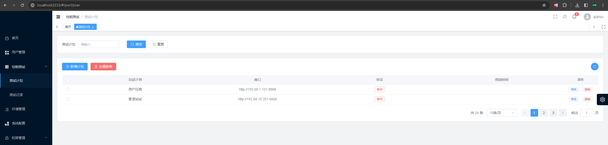

# 说明

这是一个基于Python+Locust+Grafana+Vue 追求简单化执行性能测试，平台化集成脚本生成、执行配置、任务管理、监控报警

* 简单
* 平台化
* 易扩展

# 技术架构

后端：django+mysql+locust

前端：vue3+element-ui

性能监控：Grafana+postgressql

# 部署

## 部署基础组件

1.部署Grafana+postgressql，推荐使用docker部署，项目下有docker-compose.yml文件，可参考部署
2.建好数据库/assets/timescale_schema.sql有脚本
3.部署Grafana，导入好监控指标

参考：locust_plugins [https://github.com/SvenskaSpel/locust-plugins/tree/master/locust_plugins/dashboards](https://)

## 部署前端

```bash
# 进入前端项目目录
cd ui-colo
# 安装前端依赖
npm install
# 运行前端服务
npm run dev
# 打包预发布环境
npm build:stage

# 打包正式环境
npm build:prod

```

## 部署后端

```bash
# 安装依赖
pip install -r requirements.txt
# 建colo需要的库表

# 运行后端服务
python3 manage.py runserver 0.0.0.0:8000

```

# 运行

浏览器打开访问localhost:3333


## 平台操作

# 手动运行locust

```shell
 locust --timescale --headless --override-plan-name 0108
```

# 平台流程

# 注意点记录：

mysqlclient无法安装，在settings使用pymysql转换
locust-plugins依赖问题
locustfile脚本，需要增加pgsqldb的环境变量配置
docker化部署pgsql+grafana
locustfile要自动生成，还要分发到每个压力机上

# 部署过程环境遇到的问题

## docker 部署在另一台局域网的macmini上，远程访问，需要开启ssl

[Service]
ExecStart=/usr/bin/dockerd -H tcp://0.0.0.0:2375 -H unix://var/run/docker.sock

2、Docker进程监听2375端口，接受远程访问。但是在MacOS下，却无法使用。需要做如下两步配置：

brew install socat
socat TCP-LISTEN:2375,reuseaddr,fork UNIX-CONNECT:/var/run/docker.sock &

报错了，网上找到解决方案

使用socat镜像开启服务

docker run -d --name socat --restart always -p 2375:2375 -v /var/run/docker.sock:/var/run/docker.sock alpine/socat tcp-listen:2375,fork,reuseaddr unix-connect:/var/run/docker.sock\

配置

vi ~/.bash_profile

export DOCKER_HOST=tcp://localhost:2375

重启生效

source .bash_profile

# todo

* [ ]  脚本上传管理
* [ ]  分布式执行
* [ ]
